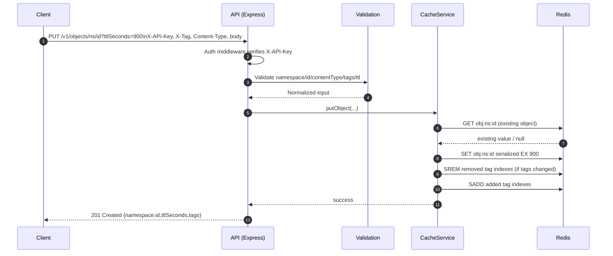
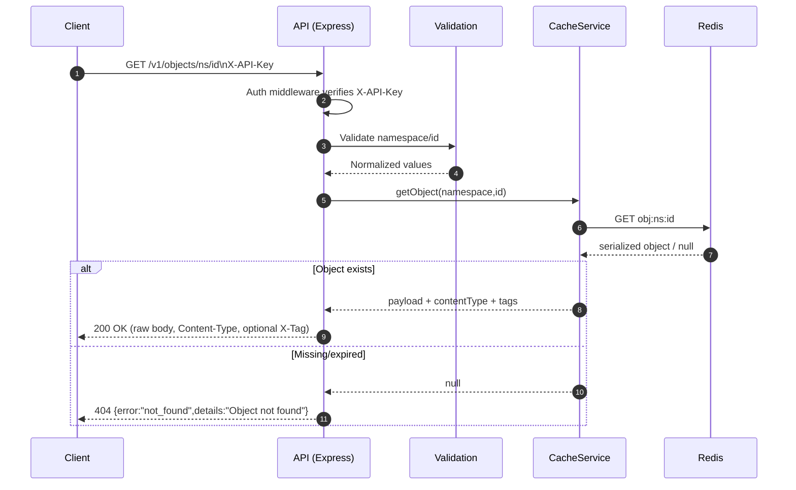
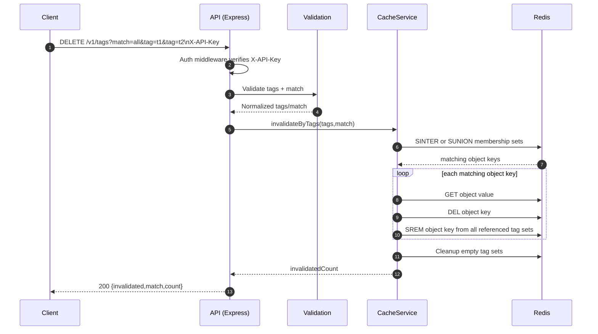

# memcache-api Architecture and Request Flow

This document explains how the service is structured and how requests flow through the system.

## High-Level Components
- `src/server.js`: starts HTTP server and initializes Redis connection.
- `src/app.js`: wires middleware and routes.
- `src/middleware/auth.js`: enforces API key authentication via `X-API-Key` when configured.
- `src/routes/*.js`: HTTP endpoints for objects, tags, health, and docs.
- `src/services/cacheService.js`: core Redis interactions and invalidation logic.
- `src/storage/redisClient.js`: shared `ioredis` client.
- `src/utils/validation.js`: request/path/tag/TTL validation.

## Data Model in Redis
- Object key: `obj:{namespace}:{id}`
- Tag index key: `tag:{base64url(tag)}`
- Object value (JSON-serialized):
  - `payload` (base64-encoded bytes)
  - `contentType` (original `Content-Type`)
  - `tags` (deduplicated tag array)

## Runtime Request Pipeline
1. Request enters Express app (`helmet`, `morgan`).
2. Auth middleware checks `X-API-Key` if API key is configured.
3. Route validates identifiers/tags/TTL/content type.
4. Route calls cache service.
5. Cache service reads/writes Redis object keys and tag index sets.
6. Route returns API response (or standard error envelope on failure).

## Sequence Diagrams (Mermaid)

### Store Object (`PUT /v1/objects/{namespace}/{id}`)

### Retrieve Object (`GET /v1/objects/{namespace}/{id}`)

### Invalidate by Tags (`DELETE /v1/tags?match=all|any&tag=...`)

## Operational Notes
- TTL expiry in Redis acts as implicit invalidation; expired objects are returned as 404.
- Tag indexes are maintained on write and delete to keep invalidation bounded and deterministic.
- All errors use `{ "error": "string", "details": "optional" }`.
